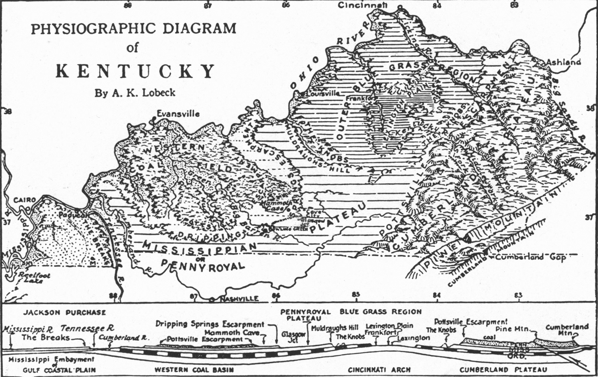

# The Historic Entrance to Mammoth Cave

     
*Historic Entrance into Mammoth Cave*

## Introduction

This modest cave opening leads visitor into a vast underworld with a unique ecosystem and history. The park was established in 1941, became a World Heritage Site in 1981, and is visited by over 500,000 adventurers each year (<a href="https://en.wikipedia.org/wiki/Mammoth_Cave_National_Park">wikipedia.org</a>). Goals of this project include

* mapping the entrance and surrounding area with high-resolution aerial lidar data
* measure karst features
* visualize the above-ground features around the entrance

## Location of the park

    
*Location of Mammoth Cave in Kentucky*

Mammoth Cave is located in Kentucky's Pennyroyal Region (also known as the Mississippian Plateau), a limestone plain characterized by karst features such caves, sinking streams, large springs, and sinkholes. The Mammoth Cave-Flint Ridge cave system is the longest known cave in the world ([Kentucky Geological Survey](https://www.uky.edu/KGS/geoky/regionPennyroyal.html)). 

    
*Physiographic Diagram of Kentucky ([Kentucky Paleontological Society](http://www.uky.edu/OtherOrgs/KPS/))*

## Area around Historic Entrance

A visitor can find the Historic Entrance in streamless valley within quarter-mile walk of the visitor center.

    
*Location of Mammoth Cave in Kentucky ([Load GeoPDF](basemap/maca-basemap.pdf))*

### Trail map

The area around the visitor center and offers over seven miles of trails leading many scenic features.

    
*Location of Mammoth Cave in Kentucky ([Open map](https://tastyfreeze.github.io/maca/map))*

### Video fly-through

This animated point cloud shows the trail that leads to the entrance and cave opening. The camera flys under the pedestrian bridge that connects the Visitor Center with the gift shop. The points are colored by the 2018 color aerial photography. Ground features covered by tree canopy are colored by the top of the canopy.

    
*Fly-through video to the entrance ([Watch video](https://youtu.be/BVVCe_BSsT4))*

### 3D map

The open source [Potree](http://potree.org/) point cloud renderer quickly builds an interactive, 3D web map. The utility offers a series of tools to help viewers measure features on the map. 

    
*Interactive 3D map ([Open map](https://outragegis.com/pointclouds/maca/))*

## Estimated cliff and outcropping heights

This analysis used Focal Statistics in ArcGIS Pro to calculate the elevation range of ground features within 15 feet of each input cell of the digital elevation elevation model (DEM). Only elevation ranges over 30 feet are shown. One can clearly see cave and spring openings.

    
*Estimated cliff heights ([Enlarge map](dsm/maca-cliff-heights.jpg))*

## Photographs

     
*Trail around the River Styx*

     
*Switchback*

     
*Green River and location of NPS weather webcam ([Link to webcam](https://www.nps.gov/subjects/air/webcams.htm?site=maca))*

## Sources and tools

Map was produced by [Tastyfreeze](https://github.com/tastyfreeze) for the University of Kentucky Department of Geography, December 2019. This presentation is part of a final project in GEO 409. 

Elevation data was acquired from the Kentucky's Elevation Data & Aerial Photography Program ([KyFromAbove.ky.gov](http://kyfromabove.ky.gov)). Color aerial imagery was acquired from the National Agriculture Imagery Program (NAIP) stored on public FTP server maintained by Kentucky Division of Geographic Information ([DGI](https://technology.ky.gov/gis/Pages/default.aspx))

Various [ArcGIS Pro](https://www.esri.com/en-us/arcgis/products/arcgis-pro/resources) lidar and digital surface model tools were used to process and analyze these data. A Python script was developed to automate this process and is found in this [Jupyter Notebook]()

